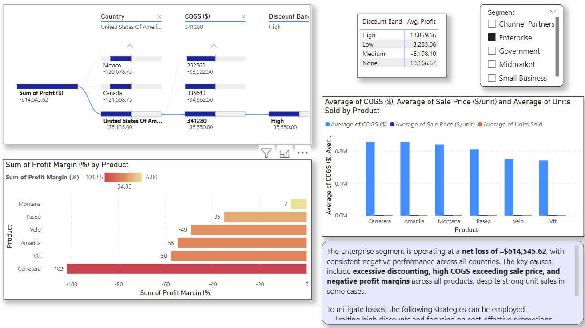
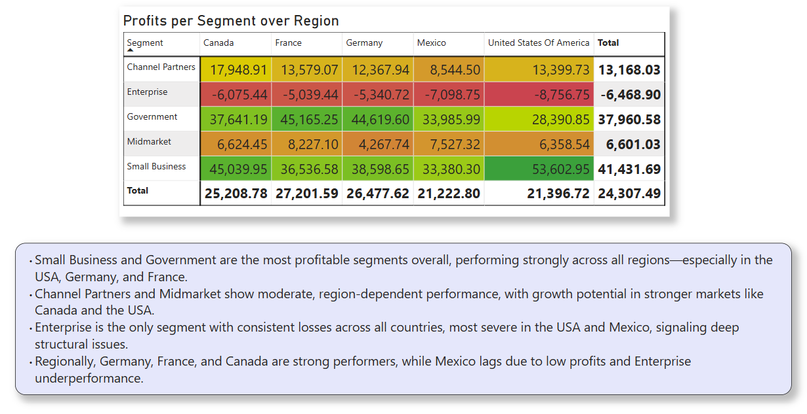
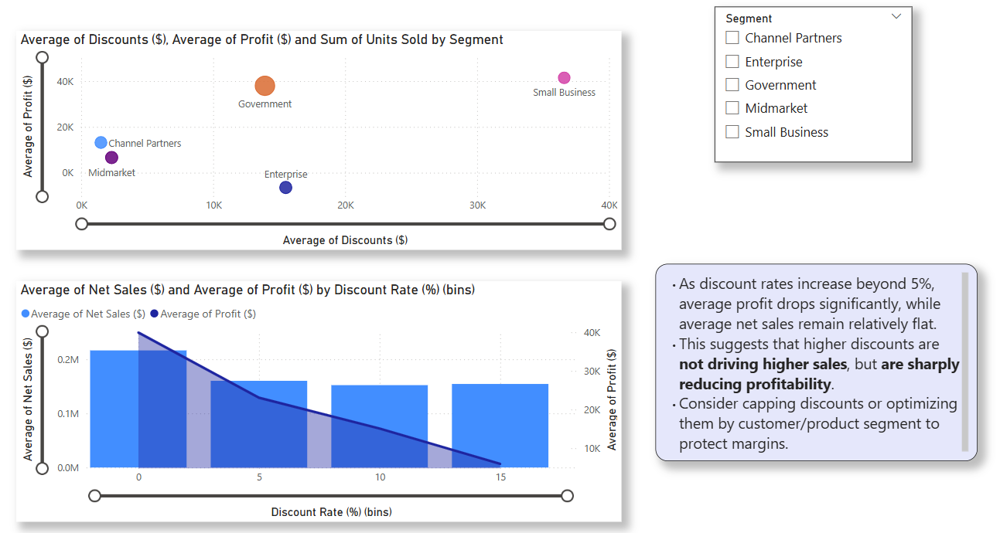
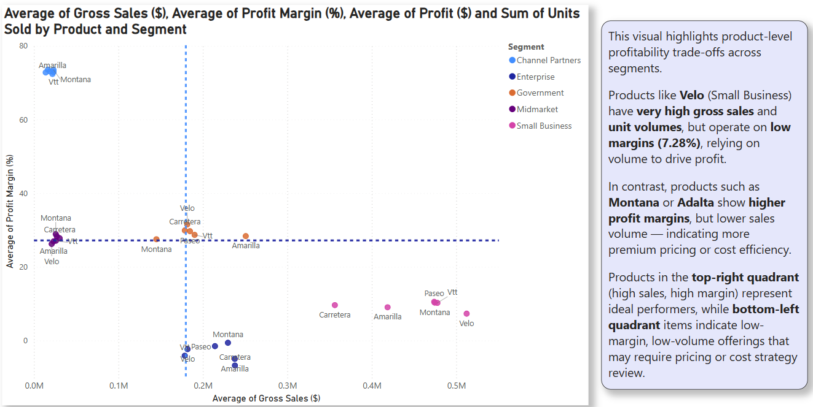

# Financial-data-analysis

This project analyzes a financial dataset of 700+ transactions across product segments, countries, and time periods to extract insights on profitability, discount effectiveness, and product performance. It uses SQL for exploration, Python (Prophet) for forecasting, and Power BI for visual storytelling.

## Technologies Used
- SQL (SQLite) – Data analysis, KPIs by segment, product, and region
- Python (Pandas, Prophet) – Data preprocessing, feature engineering, profit forecasting
- Power BI – Interactive dashboards to answer key business questions
- Excel 

## Key Business Questions Answered
- Which product segments are most and least profitable by region and over time?
- How do discounts affect profit and sales volume?
- Which countries over- or underperform vs. global averages?
- Which products yield high revenue but low profit margins?
- Why is the Enterprise segment incurring losses?
- Can we forecast monthly profits for the next year?

## Results 

This analysis uncovered critical business insights across product segments, countries, and pricing strategies. The combined use of SQL, Python, and Power BI enabled both diagnostic and predictive analytics.

### Segment Performance

- Small Business and Government are the most profitable segments, generating over $41M and $37M in profit respectively.
- Enterprise is the only loss-making segment, with a total loss of –$614K due to high discounting, excessive COGS, and a fixed pricing strategy that doesn’t reflect costs or demand.
- Midmarket is underutilized but shows high margins (27.67%), offering growth potential.

### Regional Insights
- France, Germany, and Canada consistently outperform global profit averages.
- Mexico and the USA are underperforming, with high discounting and Enterprise segment losses driving down profits.
- France is the most reliable market across both 2013 and 2014.

### Discount Analysis

- High discount rates (>8%) strongly correlate with negative profit, especially in the Enterprise segment.
- Products with no discounts average a profit of $10K+, while high-discounted products average –$18K in losses.
- Discounting fails to increase net sales meaningfully beyond a 5% threshold—indicating diminishing returns.

### Product-Level Insights

Top 5 profitable products: Paseo, Vtt, Amarilla, Velo, Montana. These products have low profit margins (26%–30%), yet drive profit through high sales volume. Products like Velo and Vtt are volume-driven success stories, but vulnerable to pricing shifts. Products like Carretera and Montana appear in both profit and loss categories depending on discounting and COGS—suggesting the need for more dynamic pricing.

### Forecasting
Using the Prophet model, monthly profit was forecasted from 2013–2015. The forecast shows a steady upward trend, with profit rising from –$0.5M in early 2013 to over $6.3M by Jan 2015. The model’s narrowing confidence interval indicates increasing predictability and financial stability.
